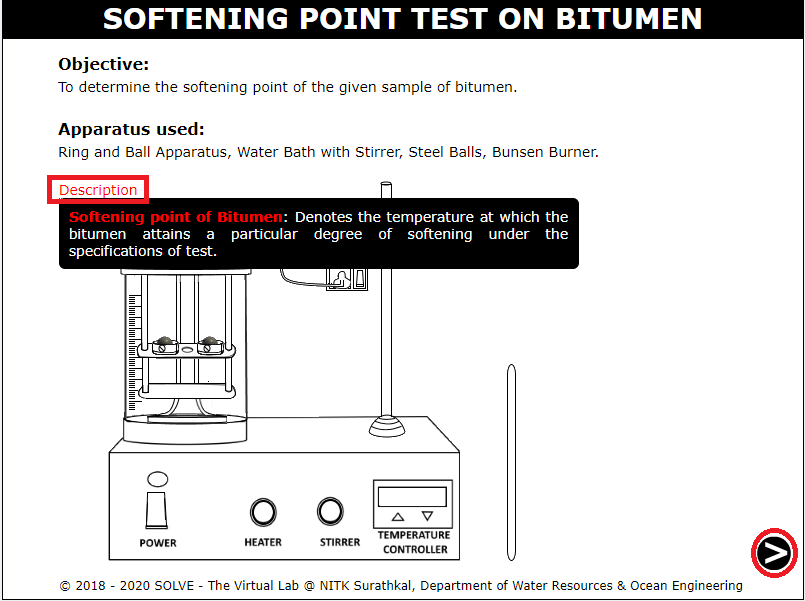
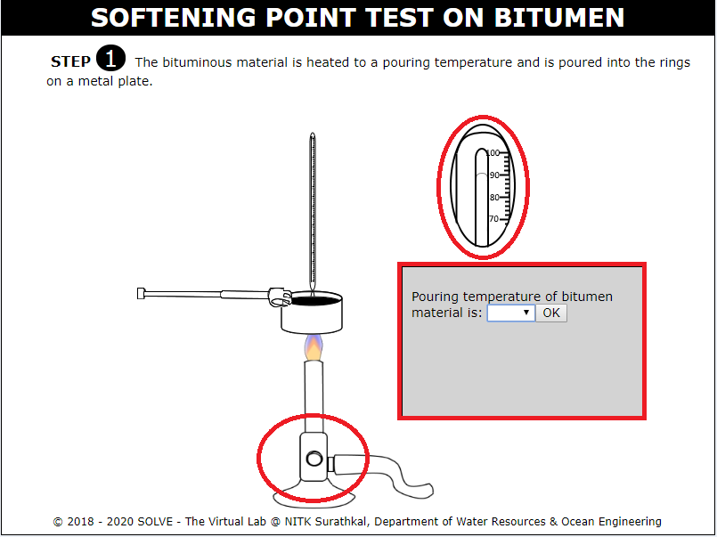
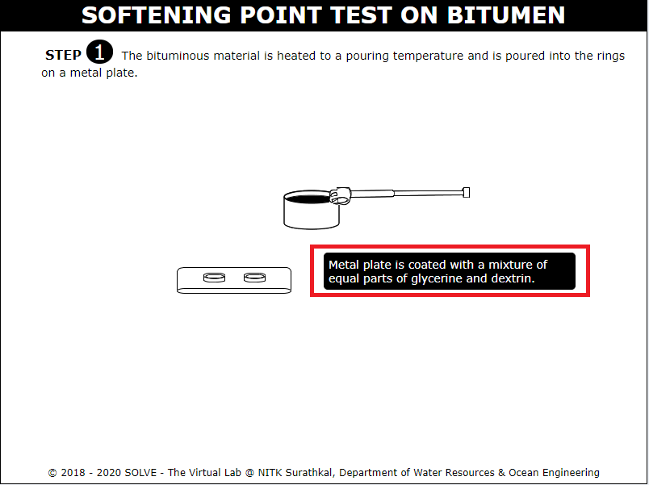
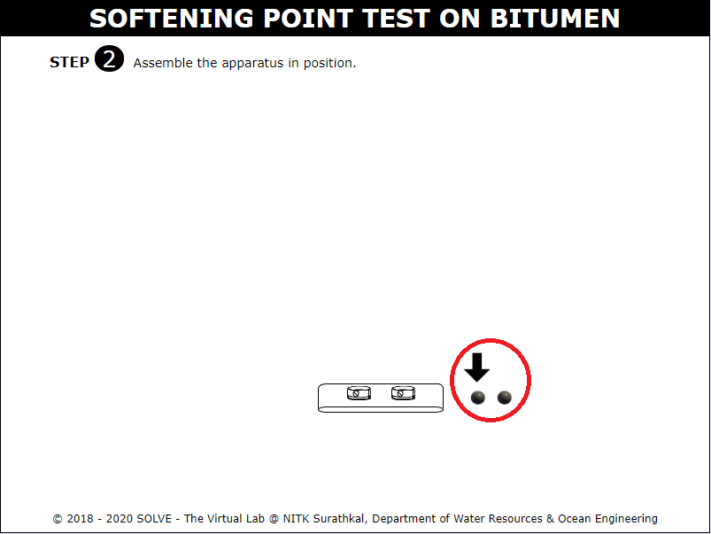
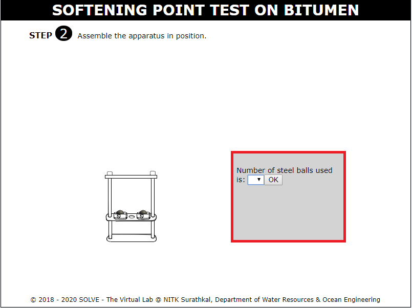
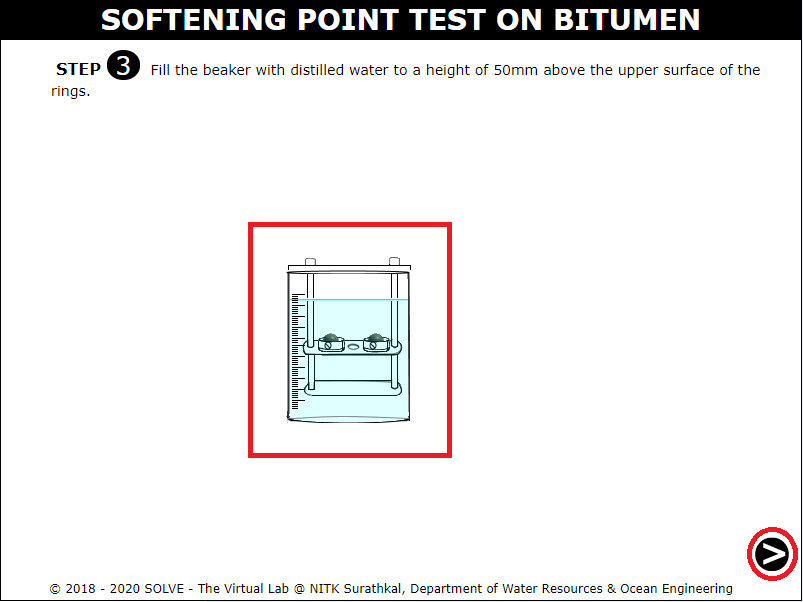
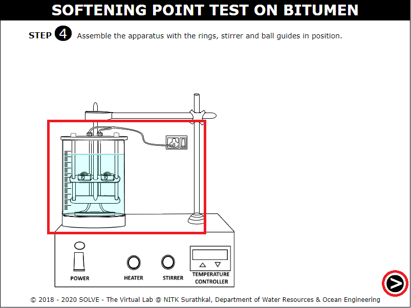
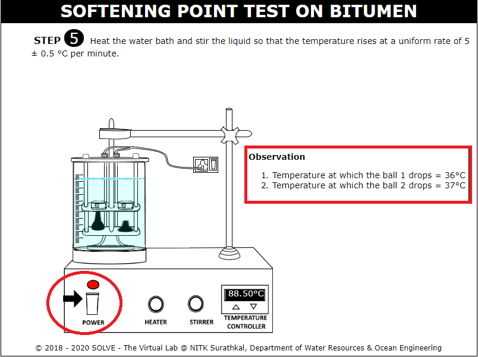
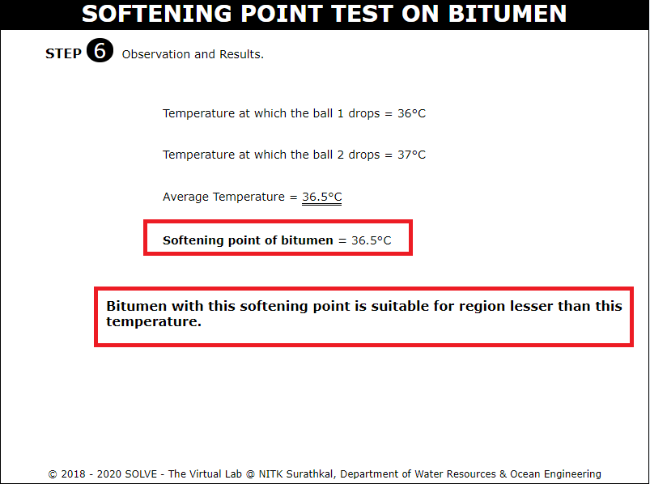

##### These procedure steps will be followed on the simulator

1. When you open Softening test on bitumen simulation, a window will open as shown below, click on Description to understand the terminologies, click on NEXT button to proceed. 
 

2. Click on the bunsen burner to heat the bitumen sample to pouring temperature, then answer the question by clicking on OK after selecting the correct answer to proceed with the simulation. 
 

3. Go through the instructions given, click on the sample to pour it into the rings on a metal plate. 
 

4. Click on balls to assemble it within the rings. 
 

5. Assemble the apparatus, then answer the question by clicking on OK after selecting the correct answer to proceed with the simulation. 
 

6. Click on beaker to fill the water up to 50mm height above the ring setup. Click on NEXT button to proceed. 
 

7. Click on apparatus to place it in position. Click on NEXT button to proceed. 
 

8. Click on heater and stirrer button to increase temperature within the bath at a uniform rate. Note down temperature at which ball drops. 
 

9. Determine the softening point of bitumen sample, then go through the inference drawn from the result. 
 
