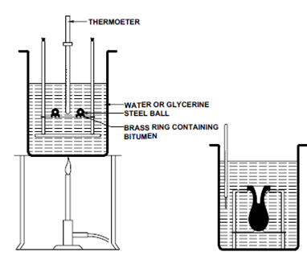

### INTRODUCTION 

Bitumen is the residue or by-product obtained by the refining of crude petroleum. A wide variety of refining techniques like straight distillation technique, solvent extraction technique etc are used to produce bitumen of different consistency and other desirable properties. Depending on the origin and other characteristics of the crude oils and property of bitumen required, more than one processing method may be employed. The type of construction decides the type of bitumen needs to be used. But in general good bitumen should have following properties.

<ol style="text-indent:25px; text-align:justify;list-style-position: inside">
<li><strong>Temperature susceptibility of bitumen</strong>: the bitumen mix should not become too soft or unstable during hot weather, and not become too brittle during cold weather.</li>

<li><strong>Viscosity of the bitumen</strong>: at the time of mixing and compaction should be adequate. This can be managed by the use of cutbacks or emulsions of suitable grades or heating the bitumen and aggregates prior to mixing.</li>

<li><strong>Affinity and adhesion of bitumen</strong>: There should be adequate affinity and adhesion between the bitumen and aggregates used in the mix.</li>
</ol>

The softening point of materials like asphalt, bitumen have no definite melting point, but when heated it gradually changes from brittle or very thick and slow-flowing materials to more mobile liquid material. The softening point of bitumen or tar is the temperature at which the substance attains particular degree of softening under specified conditions of test. The test is conducted by using Ring and Ball apparatus. A brass ring containing test sample of bitumen is suspended in liquid like water or glycerine at a given temperature. A steel ball is placed upon the bitumen sample and the liquid medium is heated at a rate of 5 degree per minute.

  

Softening Point Test Setup
 

Source: (<a href="http://www.expertsmind.com/questions/softening-point-test-30129391.aspx">http://www.expertsmind.com/questions/softening-point-test-30129391.aspx</a>)

 

As per IS: 334-1982 it is the temperature in &deg;C at which a standard ball passes through a sample of bitumen in a mould and falls through a height of 2.5 cm. The binder material used in pavement construction should have sufficient fluidity before its applications. The softening point of the binder helps to know the temperature up to which a bituminous binder should be heated for various pavement applications. Generally, higher softening point represents lower temperature susceptibility of bitumen and is preferred in warmer regions.

<strong>Relevant Indian Standard for Softening Point Test on Bitumen</strong>:

IS 1205 - 1978 : Methods for Testing Tar and Bituminous Materials : Determination of Softening Point (First Revision).

